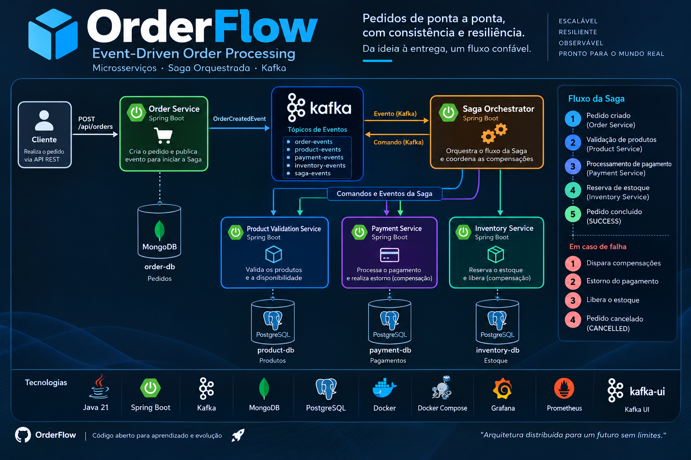

<p align="center">
  
</p>

<h1 align="center">OrderFlow</h1>
<p align="center"><strong>Event-Driven Order Processing with Saga Orchestration</strong></p>

<p align="center">
  Plataforma distribuída para processamento de pedidos construída com Java, Spring Boot e Apache Kafka, explorando Saga Orchestration, consistência eventual e transações compensatórias entre microsserviços.
</p>

<p align="center">
  
  
  
  
  
  
</p>

---


> **Engineering decisions & trade-offs:** [docs/engineering-decisions.md](docs/engineering-decisions.md) — contexto, alternativas consideradas, custos das escolhas, estratégia de testes e diagnóstico operacional.
>
> **Reliability hardening:** [docs/reliability-hardening.md](docs/reliability-hardening.md) — idempotência durável, Transactional Outbox, retry/DLT, correlation id, compensação confirmada e métricas.

## Technical Snapshot

| Focus | Evidence in this project |
|---|---|
| Target roles | Java Backend Developer · Backend Engineer · Software Engineer |
| Architecture | Microservices · Saga Orchestration · Event-Driven Architecture |
| Backend | Java · Spring Boot · REST APIs |
| Messaging | Apache Kafka |
| Distributed consistency | Saga Pattern · Compensating Transactions · Eventual Consistency |
| Reliability | Idempotent Consumers · Transactional Outbox · Retry/DLT · At-least-once |
| Traceability | eventId · transactionId · correlationId |
| Observability | Actuator · Micrometer · Prometheus |
| Data | PostgreSQL · MongoDB |
| Delivery | GitHub Actions · Maven verify · Docker Compose |

**Engineering highlights:** coordenação de fluxo distribuído, idempotência durável, Outbox transacional, retry/DLT, compensação confirmada, correlation id e métricas operacionais.

**Keywords:** `Java Backend` `Spring Boot` `Microservices` `Saga Pattern` `Apache Kafka` `Distributed Systems` `Eventual Consistency` `PostgreSQL` `MongoDB` `Docker`

---


## Sobre o projeto

O **OrderFlow** simula um fluxo de pedidos de ponta a ponta em uma arquitetura de microsserviços orientada a eventos. Em vez de utilizar uma transação ACID única envolvendo vários bancos, cada serviço mantém seus próprios dados e o **Saga Orchestrator** coordena a execução do processo distribuído através do Kafka.

O objetivo é estudar e demonstrar problemas reais de backend distribuído: **consistência eventual, isolamento de dados, comunicação assíncrona, falhas parciais, compensação e evolução para resiliência e observabilidade**.

## Arquitetura

```text
Client
  |
  | POST /api/orders
  v
Order Service ---- MongoDB
  |
  | OrderCreatedEvent
  v
Apache Kafka <------> Saga Orchestrator
                         |
              +----------+----------+
              |          |          |
              v          v          v
           Product     Payment    Inventory
          Validation   Service     Service
              |          |          |
          PostgreSQL  PostgreSQL  PostgreSQL
```

### Responsabilidade dos módulos

| Módulo | Responsabilidade | Persistência |
|---|---|---|
| `order-service` | Expõe a API REST, cria o pedido, inicia a Saga e recebe seu resultado final | MongoDB |
| `saga-orchestrator` | Coordena comandos, eventos, idempotência, Outbox, transições e compensações da Saga | PostgreSQL |
| `product-validation-service` | Valida os produtos envolvidos no pedido | PostgreSQL |
| `payment-service` | Processa pagamento e executa estorno quando necessário | PostgreSQL |
| `inventory-service` | Reserva estoque e participa do fluxo de compensação | PostgreSQL |
| `event-contracts` | Centraliza os contratos compartilhados de eventos Kafka | — |

## Fluxo da Saga

### Happy path

```text
ORDER CREATED
      |
      v
PRODUCT VALIDATION
      |
      | SUCCESS
      v
PAYMENT
      |
      | SUCCESS
      v
INVENTORY RESERVATION
      |
      | SUCCESS
      v
ORDER COMPLETED
```

O pedido começa em estado pendente. O Orchestrator recebe os eventos e determina qual etapa deve ser executada em seguida. Quando todas as etapas terminam com sucesso, a Saga é concluída e o `order-service` recebe o resultado final.

### Fluxo de compensação

Uma transação distribuída pode falhar depois que etapas anteriores já produziram efeitos. Nesse cenário, o OrderFlow executa operações compensatórias em vez de tentar realizar rollback de uma transação global.

```text
PRODUCT VALIDATION  OK
        |
PAYMENT             OK
        |
INVENTORY           FAILED
        |
        v
REFUND REQUESTED
        |
        v
PAYMENT REFUNDED
        |
        | ROLLBACK CONFIRMED
        v
ORDER CANCELLED
```

Na implementação atual, um item com `quantity > 10` pode ser utilizado para provocar a falha de Inventory e exercitar o fluxo de compensação.

## Comunicação orientada a eventos

Os microsserviços não precisam executar o fluxo inteiro de forma síncrona. Kafka atua como backbone de eventos e comandos da Saga.

Tópicos utilizados pela arquitetura:

```text
order-events
product-events
payment-events
inventory-events
saga-events
```

A comunicação agora usa **at-least-once + consumidores idempotentes**, retry limitado, Dead Letter Topics e Transactional Outbox. O projeto não reivindica exactly-once global.

Cada evento carrega três identificadores com responsabilidades diferentes:

- `eventId`: deduplicação de uma mensagem;
- `transactionId`: identidade da Saga;
- `correlationId`: rastreabilidade ponta a ponta em logs e eventos.

## Stack

| Área | Tecnologia |
|---|---|
| Linguagem | Java 21 |
| Framework | Spring Boot |
| Mensageria | Apache Kafka / Spring Kafka |
| Pedidos | MongoDB |
| Product / Payment / Inventory | PostgreSQL |
| Containers | Docker / Docker Compose |
| Build | Maven |
| Health checks | Spring Boot Actuator |
| Visualização Kafka | Kafka UI |
| Testes | JUnit 5 / Mockito / JaCoCo |
| Observabilidade | Actuator / Micrometer / Prometheus |

## Portas locais

| Componente | Porta |
|---|---:|
| Order Service | `3000` |
| Saga Orchestrator | `8080` |
| Product Validation | `8090` |
| Payment Service | `8091` |
| Inventory Service | `8092` |
| Kafka | `9092` |
| Kafka UI | `8081` |
| MongoDB | `27017` |
| Product PostgreSQL | `5432` |
| Payment PostgreSQL | `5433` |
| Inventory PostgreSQL | `5434` |
| Saga PostgreSQL | `5435` |
| Prometheus | `9090` |

## Como executar

### Pré-requisitos

- JDK 21
- Maven 3.9+
- Docker Desktop / Docker Engine
- Docker Compose
- Git

### 1. Clone

```bash
git clone https://github.com/juceliocoelho2022/orderflow-saga-orchestration.git
cd orderflow-saga-orchestration
```

### 2. Suba a stack completa

```bash
docker compose -f docker-compose.yml -f compose-apps.yml up -d --build
docker compose -f docker-compose.yml -f compose-apps.yml ps
```

Para subir somente infraestrutura, use `docker compose up -d`.

### 3. Compile e execute os testes

```bash
mvn clean verify
```

### 4. Execute os microsserviços

Os serviços podem ser iniciados pela IDE ou através dos artefatos gerados pelo Maven:

```bash
java -jar <modulo>/target/<arquivo>.jar
```

## API de pedidos

### Criar pedido

```http
POST http://localhost:3000/api/orders
Content-Type: application/json

{
  "products": [
    {
      "code": "COMIC_BOOKS",
      "unitValue": 15.50,
      "quantity": 3
    },
    {
      "code": "BOOKS",
      "unitValue": 9.90,
      "quantity": 1
    }
  ]
}
```

A criação é assíncrona e retorna **`202 Accepted`**.

### Consultar pedido

```http
GET http://localhost:3000/api/orders/{id}
```

### Consultar Saga do pedido

```http
GET http://localhost:3000/api/orders/sagas?orderId={id}
```

## Testando uma compensação

Para exercitar um cenário de falha, envie um produto com quantidade superior a `10`:

```json
{
  "products": [
    {
      "code": "NOTEBOOK",
      "unitValue": 4500.00,
      "quantity": 11
    }
  ]
}
```

O objetivo desse cenário é observar a sequência:

```text
Order
  -> Product Validation SUCCESS
  -> Payment SUCCESS
  -> Inventory FAILED
  -> Refund requested
  -> Payment REFUNDED
  -> Compensation confirmation
  -> Order CANCELLED
```

## Estrutura do repositório

```text
orderflow-saga-orchestration/
├── event-contracts/
├── order-service/
├── saga-orchestrator/
├── product-validation-service/
├── payment-service/
├── inventory-service/
├── docs/
│   └── orderflow-architecture.png
├── docker-compose.yml
├── pom.xml
└── README.md
```

## Roadmap de engenharia

- [x] Arquitetura inicial de microsserviços
- [x] Saga Orchestration
- [x] Comunicação assíncrona com Kafka
- [x] Banco isolado por contexto de serviço
- [x] Fluxo básico de compensação
- [x] Docker Compose para infraestrutura local
- [x] Idempotent Consumers
- [x] Retry com backoff
- [x] Dead Letter Topics (DLT)
- [x] Transactional Outbox Pattern
- [ ] Testcontainers para Kafka, MongoDB e PostgreSQL
- [ ] Quality Gate com JaCoCo
- [ ] Distributed Tracing com OpenTelemetry
- [x] Métricas com Prometheus
- [ ] Dashboards Grafana
- [ ] Resilience4j
- [ ] API Gateway
- [ ] Spring Security + JWT
- [x] CI com GitHub Actions
- [ ] Containerização dos microsserviços
- [ ] Kubernetes
- [ ] Terraform / Cloud

## Decisões arquiteturais

**Por que Saga Orchestration?**  
O processo possui uma sequência explícita de passos e compensações. Um Orchestrator centraliza o controle do workflow e facilita visualizar o estado da transação distribuída.

**Por que Kafka?**  
A mensageria desacopla os participantes da Saga e permite evoluir o sistema para retry, replay, DLT e processamento assíncrono.

**Por que database per service?**  
Cada microsserviço é responsável pelo próprio modelo e persistência. Isso evita acoplamento direto entre bancos e força a integração através dos contratos do domínio.

**Por que compensação?**  
Não existe rollback ACID único entre MongoDB, múltiplos PostgreSQL e Kafka. Operações compensatórias tratam efeitos já confirmados quando uma etapa posterior falha.

## Reliability hardening implementado

O incremento de confiabilidade adiciona:

- marcação durável de eventos processados nos serviços PostgreSQL;
- Outbox na mesma transação do efeito de negócio;
- Outbox embutido no documento Mongo para criação atômica de pedido + evento inicial;
- publisher at-least-once;
- retry com backoff fixo e DLT;
- confirmação do refund antes do cancelamento;
- correlation id propagado em toda a Saga;
- métricas de conclusão, falha, compensação, duplicidade, retry, DLT e Outbox;
- testes automatizados de duplicidade e compensação;
- CI com `mvn clean verify`, validação de Compose e `promtool`.

Detalhes: [docs/reliability-hardening.md](docs/reliability-hardening.md).

## Objetivos de evolução

O OrderFlow está sendo desenvolvido incrementalmente como laboratório de engenharia backend. Os próximos incrementos serão adicionados em pequenos ciclos, priorizando confiabilidade, testes automatizados, observabilidade e práticas Cloud Native.

---

<p align="center">
  Desenvolvido por <strong>Jucelio Farias Coelho</strong><br>
  Java Backend • Spring Boot • Kafka • Microsserviços • Sistemas Distribuídos
</p>

<p align="center">
  <strong>OrderFlow — pedidos de ponta a ponta com consistência e resiliência.</strong>
</p>
